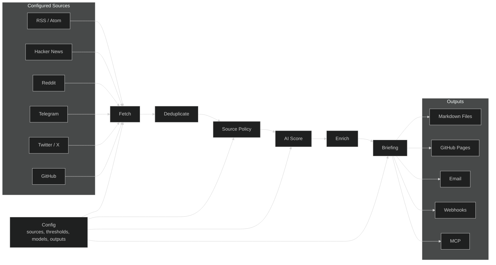

# Horizon Brief

**A fork-friendly briefing layer on top of Horizon.**

[](LICENSE)
[](https://github.com/astral-sh/uv)
[](https://github.com/AntonMiklushov/Horizon/actions/workflows/ci.yml)

Horizon Brief is a local-first AI briefing pipeline for collecting sources, scoring relevance, applying evidence-aware source policy, and generating compact briefings. It is intentionally kept as an add-on layer over the original Horizon project: the product name changes in this README, but the runtime package and command surface stay compatible.

## Overview

Horizon Brief takes a configured set of feeds and community sources, turns them into ranked candidate items, enriches the important ones with context and discussion, and writes the result as Markdown. The fork is tuned for personal briefing workflows, including conservative source handling and Russian personal briefing output, while retaining the broader Horizon pipeline.

The project can run fully locally from a checkout, in Docker, through scheduled GitHub Actions, or as an MCP-compatible service for AI assistants. It supports API-based model providers and a local Codex CLI provider for environments where a logged-in Codex session should be used instead of an `OPENAI_API_KEY`.

## Relationship to Horizon

Horizon Brief is a fork of [Horizon](https://github.com/Thysrael/Horizon). It does not perform a full technical rename in this pass.

- The Python package name remains `horizon`.
- CLI commands remain `horizon`, `horizon-wizard`, `horizon-web`, `horizon-mcp`, and `horizon-webhook`.
- Existing import paths remain in place for compatibility.
- Fork-only product additions live under `src.horizon_ext` to keep upstream rebases practical.
- Runtime state remains local and ignored: `data/config.json`, generated summaries, run artifacts, subscribers, backups, and secret-like files should not be committed.

## What Horizon Brief Adds

- Evidence-aware personal briefing mode with source role classification, claim type metadata, confidence, and evidence strength.
- Russian personal briefing output by default when personal briefing mode is enabled.
- Codex CLI provider support for using a local `codex login` session without requiring `OPENAI_API_KEY`.
- A local web dashboard for configuring and launching runs from the browser.
- Fork-local rendering, source-quality, MCP, and run-safety helpers isolated under `src.horizon_ext`.
- Compatibility with the original multi-source Horizon workflow: fetch, deduplicate, score, filter, enrich, summarize, and deliver.

## How It Works



1. Configure sources, thresholds, model provider, language, and output channels.
2. Fetch recent items from enabled sources.
3. Deduplicate repeated stories across platforms.
4. Apply source policy and, in personal briefing mode, exclude blocked or unsuitable factual sources before scoring.
5. Score and filter items with the configured AI provider.
6. Enrich important items with background context and available community discussion.
7. Generate Markdown briefings and deliver them through the configured outputs.

## Quick Start

### Local Installation

```bash
git clone https://github.com/AntonMiklushov/Horizon.git
cd Horizon

uv sync
```

You can also install the project in editable mode with pip:

```bash
pip install -e .
```

On Windows, if the checkout is inside a Nextcloud, OneDrive, or similar synced folder, place uv's environment and cache outside the repository before `uv sync`:

```powershell
$horizonState = Join-Path $env:LOCALAPPDATA "Horizon"
$env:UV_PROJECT_ENVIRONMENT = Join-Path $horizonState "uv-env"
$env:UV_CACHE_DIR = Join-Path $horizonState "uv-cache"
New-Item -ItemType Directory -Force $horizonState | Out-Null
uv sync
```

### Docker

```bash
git clone https://github.com/AntonMiklushov/Horizon.git
cd Horizon

cp .env.example .env
cp data/config.example.json data/config.json

docker-compose run --rm horizon
```

## Configuration

Start from the example files and keep local runtime configuration out of git:

```bash
cp .env.example .env
cp data/config.example.json data/config.json
```

For personal briefing mode, the example config already points `personal_briefing.source_policy_file` at `data/config.personal-news.example.json`. Keep private source choices and secrets in `data/config.json`; create a separate private policy file only if your local ignore rules cover it.

Minimal API-provider configuration:

```jsonc
{
  "ai": {
    "provider": "openai",
    "model": "gpt-4",
    "api_key_env": "OPENAI_API_KEY"
  },
  "sources": {
    "rss": [
      {
        "name": "Simon Willison",
        "url": "https://simonwillison.net/atom/everything/"
      }
    ]
  },
  "filtering": {
    "ai_score_threshold": 6.0
  }
}
```

To use a local Codex CLI session instead of API keys, set the provider to `codex_cli` in `data/config.json`. This path uses `codex exec` through the locally authenticated Codex CLI session and does not require `OPENAI_API_KEY`.

For the full configuration reference, see [docs/configuration.md](docs/configuration.md). For Codex CLI setup, see [docs/codex_cli_provider.md](docs/codex_cli_provider.md). For personal briefing behavior, see [docs/personal_briefing.md](docs/personal_briefing.md).

## Run Modes

Run the default pipeline:

```bash
uv run horizon
```

Run with an explicit lookback window:

```bash
uv run horizon --hours 48
```

Generate a configuration interactively:

```bash
uv run horizon-wizard
```

Start the local web dashboard:

```bash
uv run horizon-web
```

Start the MCP server:

```bash
uv run horizon-mcp
```

Send webhook output through the webhook CLI:

```bash
uv run horizon-webhook
```

With Docker:

```bash
docker-compose run --rm horizon
docker-compose run --rm horizon --hours 48
```

Generated summaries are written to `data/summaries/`.

## Outputs and Integrations

| Channel | What it does |
| --- | --- |
| Local Markdown | Saves generated briefings under `data/summaries/`. |
| GitHub Pages | Copies publishable Markdown into `docs/` for a Jekyll-backed daily briefing site. |
| Email | Sends briefings through SMTP and handles subscribe or unsubscribe requests through IMAP. |
| Webhooks | Sends success, failure, overview, or item-level notifications to Feishu/Lark, DingTalk, Slack, Discord, or a custom endpoint. |
| MCP | Exposes pipeline steps as MCP tools for assistants and MCP-compatible clients. |
| Local Web Dashboard | Provides a browser UI for basic configuration, run staging, execution, and summary viewing. |

Supported source families include RSS/Atom, Hacker News, Reddit, Telegram, Twitter/X, and GitHub user or release activity.

## Documentation

| Guide | Description |
| --- | --- |
| [Configuration](docs/configuration.md) | AI providers, sources, filtering, email, webhook, GitHub Pages, and MCP setup. |
| [Personal Briefing](docs/personal_briefing.md) | Evidence-aware personal briefing mode and source policy behavior. |
| [Codex CLI Provider](docs/codex_cli_provider.md) | How to run model calls through a local Codex CLI login. |
| [Scoring](docs/scoring.md) | How items are evaluated and ranked. |
| [Scrapers](docs/scrapers.md) | Source scraper details and extension notes. |
| [MCP Tools](src/mcp/README.md) | Tool reference for MCP-compatible clients. |
| [Fork Architecture](docs/fork_architecture.md) | How fork-only additions are isolated for easier upstream rebases. |

## Project Status

Horizon Brief currently supports the full briefing loop: multi-source collection, deduplication, source policy, AI scoring, enrichment, comment summaries, Markdown generation, GitHub Pages publishing, email delivery, webhook delivery, Docker deployment, MCP integration, local web runs, and the setup wizard.

This repository intentionally keeps the original `horizon` package and command names. A deeper rename would require coordinated changes across packaging, CLI entrypoints, documentation, generated filenames, workflows, and tests, and is outside the scope of this README repositioning.

## Acknowledgements

Horizon Brief builds on the original [Horizon](https://github.com/Thysrael/Horizon) project and keeps its compatibility surface where practical.

## License

[MIT](LICENSE)

## Generative Modification Notice

Generative modification notice: Horizon Brief is a generative modification of Horizon, shaped and documented with assistance from Codex.
